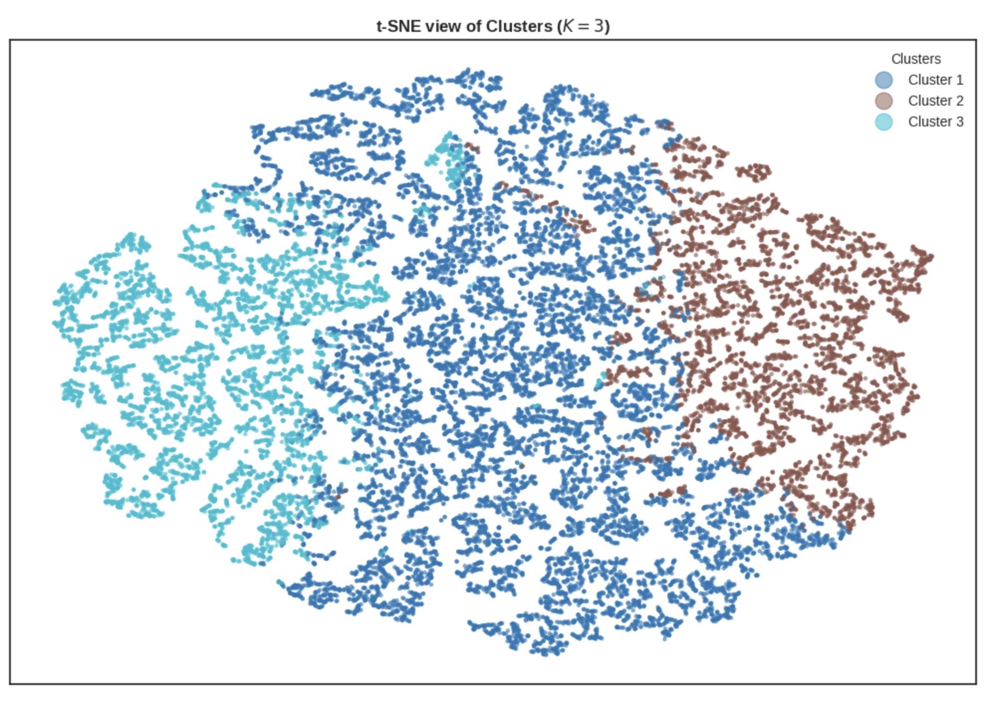

# Customer Segmentation with Clustering

- 

- **Background**: This was an assessed project that I completed as part of my course in Data Science, with Machine Learning and AI, at the University of Cambridge.
- **Problem**: Segment customers of a multinational e-commerce company to inform targeted marketing and retention strategies.
- **Data**: 951k+ order rows across 47 countries (2012–2016). Final modelling uses customer-level features: frequency, recency, CLV, average unit cost, and age.
- **Deliverables**: Jupyter notebook with full workflow and visuals, PDF report with findings and recommendations.

## Approach
- **Data cleaning**:
  - Identified and removed duplicate records
  - Converted `Order_Date`, `Delivery_Date`, and `Customer_BirthDate` to datetime.
- **Feature engineering**:
  - Customer-level aggregation to one row per customer.
  - Computed five core metrics: purchase frequency, recency, customer lifetime value (CLV), average unit cost, and customer age.
  - Scaled features (and encoded if required via pipelines/column transformers).
- **Model selection**:
  - Determined candidate `k` via Elbow and Silhouette analyses.
  - Explored hierarchical clustering (dendrogram) for structure and potential `k`.
  - Trained K-means with selected `k` and profiled clusters.
- **Visualisation**:
  - Boxplots of clusters vs. each feature (frequency, recency, CLV, avg. unit cost, age).
  - 2D embeddings with PCA and t-SNE to display cluster separation.

## Key Results
- **Optimal k**: Selected using Silhouette and Elbow criteria, corroborated by hierarchical structure.
- **Cluster profiles**: Distinct segments by spend (CLV), purchase cadence (frequency/recency), price sensitivity (avg. unit cost), and age bands. Actionable personas identified for targeted campaigns and retention strategies.

## How to Reproduce
1. Open .
2. Ensure dependencies are installed:
   - pandas, numpy, scikit-learn, matplotlib, seaborn, scipy
3. Run cells sequentially. The notebook loads data from the provided public URL, performs cleaning, aggregation, selection of `k`, clustering, and visualisations.
