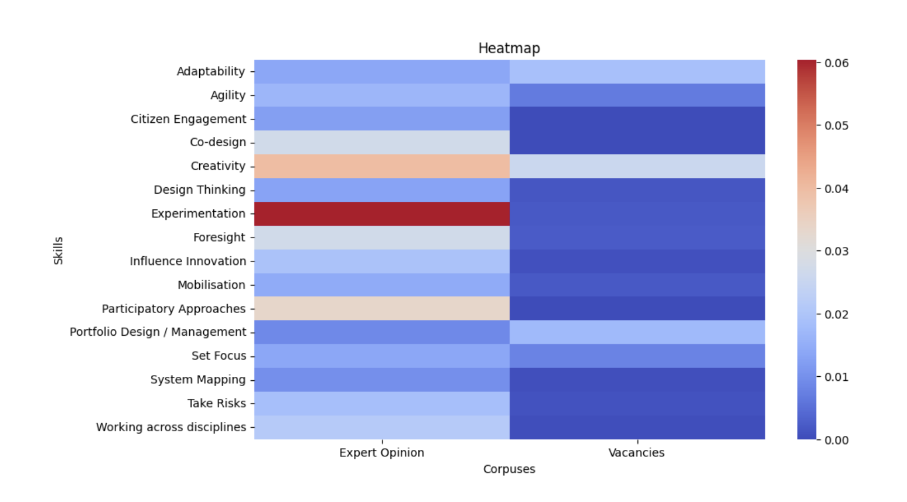

# Measuring the readiness of the UK Civil Service to deliver ambitious change

## Problem
At the time of this analysis, a new admistration in the UK was committed to a set of five missions in order to "put an end to sticking plaster politics". A mission-driven approach to governing is a commitment to a set of ambitious goals - such as achieving net zero - that cut across existing organisational boundaries, and that require innovation and cross-sector collaboration to achieve them.

In many ways, this approach makes greater demands on government bureaucracies. However, there were no data driven insights available into, on the one hand, the skills that governments need to draw on if they are to successfully realise this approach nor, on the other hand, the availability of these skills in the UK Civil Service.

This research filled those gaps. Its findings were described by an expert external reviewer as "a substantial advance on academic or professional thinking."

## Methodology
Without direct access to people data in the UK Civil Service, job vacancies issued through the UK Civil Service Recruitment Gateway were treated as proxy meansures of the skills that they recognise as important, and have in place. These vacancies, all at Grade Six or higher, were webscraped from mid-February to mid-June 2024.

Alongside this, a corpus of expert writings on 'Mission driven change was collected. This amounted to over one million words of writing and covered perspectives that ranged from 'making the case' policy documents to programme evaluations.

A bottom-up process was used to identify the skills that were mentioned in this corpus. For example, skills such as 'creating a coalition' or 'experiementation' were identified. These were then translated into patterns of words and grammatical patterns, and the Tf-IDF metric was used to compare their importance in the literature with their importance in the bank of Civil Service job vacancies.

## Data
The analysis is based on 35 documents from the literature, and nearly 5,000 civil service vacancies.

## Results
A heat-map comparison of how important a skill is in expert literature compared to its importance in the bank of Civil Service job vacancies shows this picture:

For example, it shows that the skill of 'experimenation' is a key capability gap.

**How to Reproduce**

The four files in this repository are executed in the following sequence:

One: Vacancy Scraper - to web-scrape Civil Service vacancies

Two: Skill_Patterns - to create the .json file of patterns that are used for matching in the other two files

Three: Skills_ID - to identify the skills, and their importance, in the corpus of expert literature

Four: Gap_Analysis - to identify the difference, in importance, that the skills recieve in expert literatures Vs in Civil Service Vacancies
