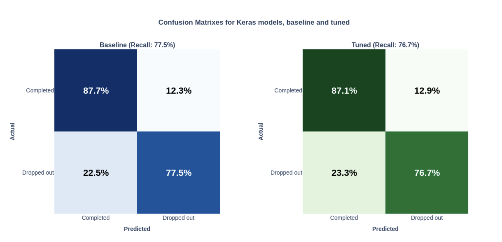

# Applying supervised learning to predict student drop-out

- **Background**: This was an assessed project that I completed as part of my course on Data Science, with Machine Learning and AI, at the University of Cambridge.
- **Problem**: Create, HP tune and evaluate XGBoost and Keras models to predict student drop-out on three data sets that progressively provide more student information.
- **Data**: 25_000 + rows, with each row representing a student. Three sets of data were provided for the models to operate on. At Stage One, demographic data is presented. At Stage Two, behavioural data is introduced. At Stage Three, student achivement data is introduced.
- **Deliverables**: Gooogle Collab notebook with full workflow and visuals, PDF report with findings and recommendations.

## Approach
- **Data cleaning**:
  - Remove any columns not useful in the analysis.
  - Remove columns with categorical features with high cardinality (>200 unique values).
  - Remove columns with > 50% data missing.
  - Ordinal encoding for ordinal data.
  - One-hot encoding for all other categorical data
- **Feature engineering**:
  - When missing, Home City imputed based on the mode value for the student's nationality
- **Model selection**:
  - XGBoost - baseline models and hp tuned
  - Keras - baseline models and hp tuned
  - Given imbalance in the dataset, the loss metric used was Precision, Recall Area Under the Curve (PR_AUC)
- **Visualisations**:
  - Confusion Matrixes
  - Plots of PR_AUC
  - SHAP values

## Key Results
- **At risk factors**: When student demographic data only is avaialble, where students are from and where they study should guide a support strategy to minimise the risk of student drop-out. When behavioural data - such as authorised and unauthorised absences - is available, predictive accuracy increases. Student achievement data appears to be a surrogate for actual studnet drop-outs, and has little predictive worth.
- **Preferred model**: hp tuning delivered very small improvements on the baseline models. XGBoost performed better than Keras, but by a small degree

## How to Reproduce
1. Open Applying supervised learning to predict student dropout .ipynb
2. Ensure dependencies are installed
3. Run cells sequentially. The notebook loads data from the provided public URL.
