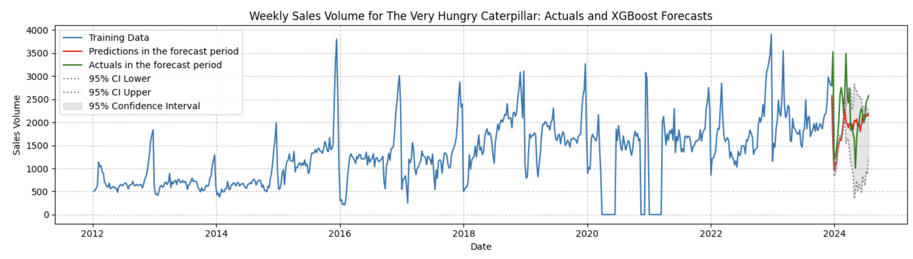

# Forecasting future book sales

- **Background**: This was an assessed project, completed as part of my course on Data Science, with Machine Learning and AI, at the University of Cambridge.
- **Problem**: Using historical book sales data, identify the best model for predicting book sales in a 32 weeks forecast period  
- **Data**: Sales information on 61 book titles, covering the period January 2021 to July 2024, sourced from Nielsen's BookScan service
- **Deliverables**: Gooogle Collab notebook with full workflow and visuals, PDF report with findings and recommendations.

## Approach
- **Data**:
  - Prepare data for time-series analysis
  - Re-sample on a weekly or monthly basis.
- **Models trained and evaluated**:
  - SARIMAX
  - XGBoost 
  - LSTM
  - Hybrid approaches combining ARIMA and LSTM
- **Visualisations**:
  - Autocorrelation Function (ACF) and Partial Autocorrelation Function (PACF) plots
  - Plots of actuals Vs predictions and Confidence Intervals.

## Key Results
- Judged on the loss metric of Mean Absolute Percentage Error (MAPE) the best performing model was the hybrid approach of ARIMA x LSTM
- The model did a good job at tracking the baseline behaviour of the sales data, but performed poorly at predicting spikes in demand 
- In response, future work should look to incorporate exogenous features - for example, marketing spend or social media trends.

## How to Reproduce
1. Open Using_time_series_analysis_for_sales_and_demand_forecasting.ipynb
2. Ensure dependencies are installed
3. Run cells sequentially. The notebook loads data from the provided public URL.
